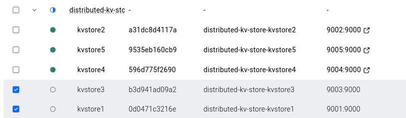
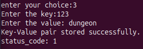
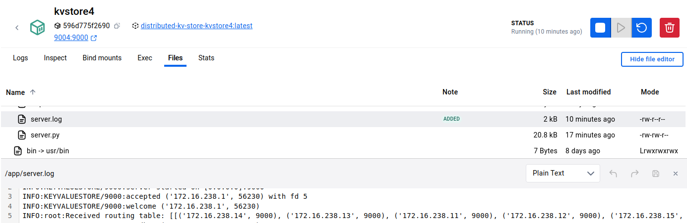
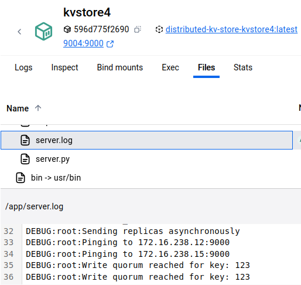
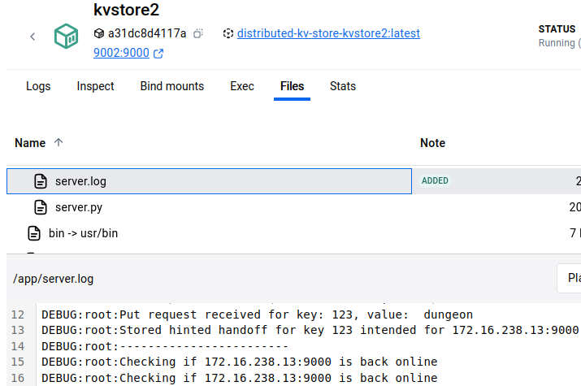
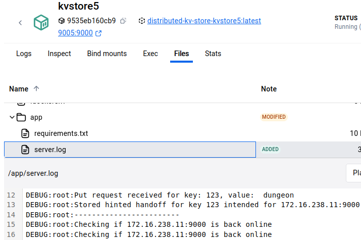
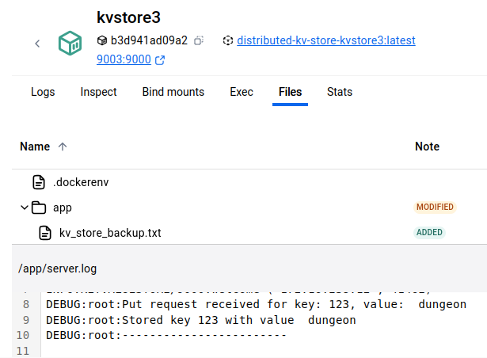
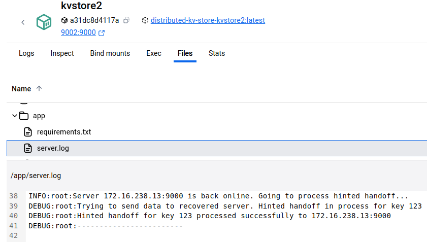

## Performance Result
|    | Distribution   | Operation   |   Count |   Avg Latency (ms) |   Min (ms) |   Max (ms) |   Median (ms) |   P99 (ms) |   Throughput (ops/sec) |
|---:|:---------------|:------------|--------:|-------------------:|-----------:|-----------:|--------------:|-----------:|-----------------------:|
|  0 | uniform        | get         |    1000 |            12.2481 |    9.25517 |    41.9874 |       11.9509 |    17.0914 |                81.5347 |
|  1 | uniform        | put         |    1000 |            14.24   |   11.8527  |    22.8443 |       13.9279 |    19.8593 |                70.1379 |
|  2 | hotspot        | get         |    1000 |            12.4393 |    9.52077 |    26.0901 |       12.0513 |    17.0474 |                80.281  |
|  3 | hotspot        | put         |    1000 |            14.1479 |   11.3246  |    37.1773 |       13.7973 |    20.2777 |                70.5962 |
## Automated tests:
Execute the run_kv_store.py, it includes the PUT and GET calls during normal operations as well as when few of the servers are down. From the root directory run

```bash
python3 run_kv_store.py
```

## Instructions:
Make sure you are in the root directory. Now, create a virtual environment, activate it, and install the dependencies.

```bash
source .venv/bin/activate
pip3 install -r requirements.txt
```

Run the load balancer in one terminal and the client on the other.
```bash
python3 loadBalancer/consistentHashing.py

# open another terminal
python3 client/client.py
```

Now to setup the servers, use docker-compose to build the images and run it using:
Now to setup the servers, use docker-compose to build the images and run it using:
```bash
docker-compose build
docker-compose up -d
```
If the port 9000 is already in use then change it to whichever is available and change _translate_address functions a bit.

Now, choose one of the operations from the client side. Make sure that the servers are up before doing this.
If the port 9000 is already in use then change it to whichever is available and change _translate_address functions a bit.

Now, choose one of the operations from the client side. Make sure that the servers are up before doing this.

To keep track of what is happening to the server, client, and LB you can look at .log files.


## Correctness Check
|.                                  |.                          |
------------------------------------|---------------------------
|||

The image on the left shows the status of the 5 servers. Server kvstore1 and kvstore3 are down for the moment, and a PUT request is sent from the client with **key**:123 and **value**:dungeon. This key gets mapped to the server 4 i.e., kvstore4.

 |.                                  |.                          |
------------------------------------|---------------------------
|     |      |

Inside the container kvstore4 we can see from the routing table that the key should also be sent to kvstore3 and kvstore1, but those two are down. Therefore, it sends the data to kvstore2 and kvstore5. Eventaully, in the these two servers will send the data back to kvstore 3 and kvstore 1.

|.                                  |.                          |
------------------------------------|---------------------------
|            |    |

Inside the log of kvstore2 and kvstore5 we can see that they both are pinging the intended servers in order to send the data back to the actual holder.

|.                                  |.                          |
------------------------------------|---------------------------
|            |  |

Finally, when kvstore3 was brought back it received the data from kvstore2 using the hinted-handoff mechanism.